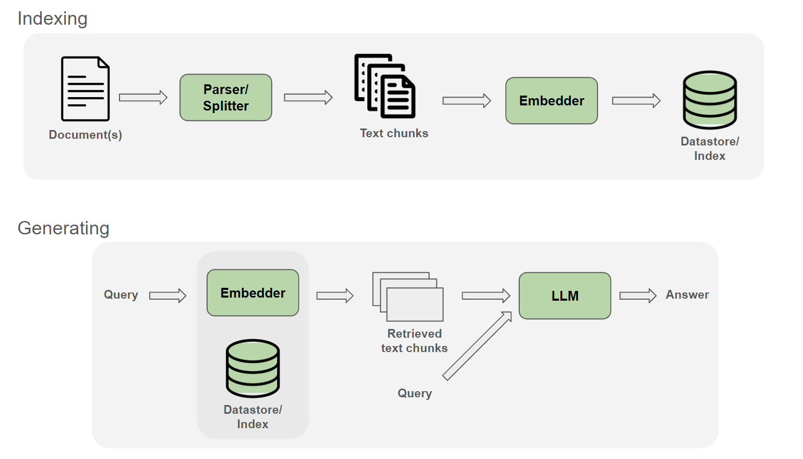
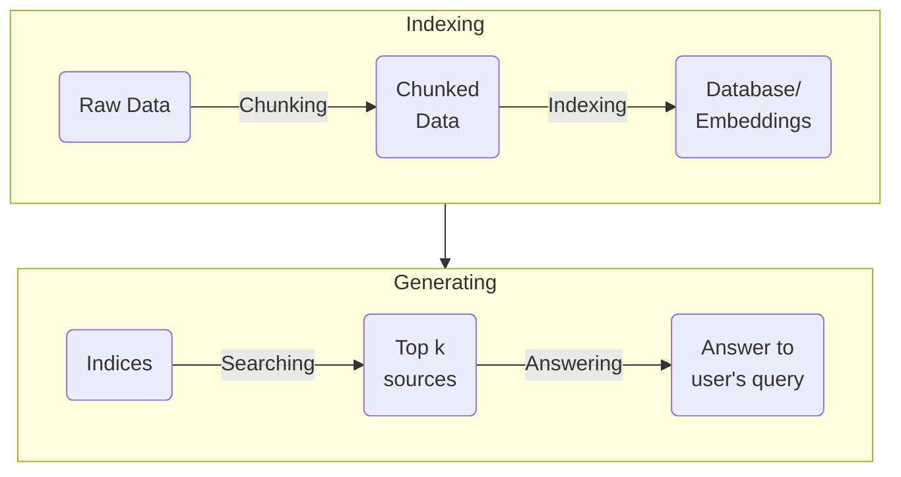

*This project has been created as part of the 42 curriculum by mpouillo.*

# RAG against the machine

[](https://github.com/mpouillo/42-rag-against-the-machine/actions/workflows/lint.yml)

- [Instructions](#instructions)
- [Description](#description)
	- [Overview](#overview)
	- [System architecture](#system-architecture)
	- [Chunking strategy](#chunking-strategy)
	- [Retrieval method and performance analysis](#retrieval-method-and-performance-analysis)
	- [Design decisions](#design-decisions)
	- [Challenges faced](#challenges-faced)
	- [Example usage](#example-usage)
- [Resources](#resources)

## Instructions

Install the project using the provided Makefile:

```shell
$> make install
# Installing uv...
# Creating virtual environment and installing dependencies...
```

Available commands:

```shell
$> uv run python3 -m src index [--max_chunk_size=<int:2000>]
# Index data from 'data/raw/' and save it to 'data/processed/'

$> uv run python3 -m src search <query> [--k=<int:10>]
# Search index and retrieve top k matching sources for provided query

$> uv run python3 -m src search_dataset <dataset_path> [--k=<int:10>] [--save_directory=<path>]
# Search index and retrieve top k matching sources for each query
# in the provided dataset, saving results to file.

$> uv run python3 -m src answer <query> [--k=<int:10>]
# Search index and retrieve top k matching sources for provided query,
# then answer them using a LLM.

$> uv run python3 -m src answer_dataset <student_search_results_path> [--save_directory=<path>]
# Answer dataset queries based on retrieved sources using a LLM,
# saving results to file.

$> uv run python3 -m src evaluate <student_answer_path> <dataset_path> <k> <max_context_length>
# Evaluate student search results based on reference dataset.
```

Check source code for programmatic and stylistic errors:

```shell
$> make lint
# Running flake8 and mypy...

$> make lint-strict
# Running flake8 and mypy --strict...
```

Remove any temporary files (`__pycache__` or `.mypy_cache`):

```shell
$> make clean
# Cleaning temporary files...
```

Remove virtual environment files:

```shell
$> make fclean
# Removing virtual environment files...
```

## Description

### Overview

**Retrieving Augmented Generation** (RAG) is a technique that consists of supplementing a LLM with external source of information to fill the holes in its knowledge. Combining its training data with this external data allows it to provide better and more accurate answers.

Basic RAG Pipeline:

- **Indexing**: Building an index from text corpus with an embedder for retrieval.

- **Searching**: Given a query, embed the query with the embedder, then search for related context embeddings from the index.

- **Answering**: The retrieved contexts are concatenated with the query to feed into the LLM to generate the answer.

<div style="text-align:center">
	
	<p>source: <a href="https://docs.nvidia.com/nemo-framework/user-guide/24.07/rag/ragoverview.html">NVIDIA NeMo Framework User Guide</a></p>
</div>

### System architecture



- Chunking:
	- Data is parsed into small chunks of different size (all below `max_chunk_size`).

- Indexing:
	- Chunks are passed to BM25 and a Vector indexer to be indexed.
	- Index data is saved to file.

- Search:
	- Index data is loaded.
	- User query is rewritten using a local LLM.
	- BM25 and ChromaDB indices are queried to retrive top matching sources.
    - RRF (Reciprocal Rank Fusion) is used to fuse sources together.
	- The top sources are then passed through a FlashRank reranker model.
	- To satisfy the k criteria, sources are padded if needed by duplicating the last source.

- Answer:
	- Only the top sources are passed to the LLM (configurable via `constants.py`).
	- Text data is retrieved for each source and joined into a larger context.
	- Using ollama, a LLM generated an answer for each user question.
	- Multithreading is used to speed up generation.

### Chunking strategy

- Ingestion: Files are retrieved using `path.rglob()` then converted into `langchain_text_splitters.Document` objects.

- Chunking: Retrieved documents are then split using  `langchain_text_splitters.RecursiveCharacterTextSplitter()`, with language set depending on the file extension. This allows clean and efficient chunking depending on the type of file (python or markdown).

- Conversion: Split documents are then converted into `MinimalSource` objects to be processed and indexed.

### Retrieval method and performance analysis

- Indexing:
	- BM25:
		- A ranking algorithm which measures term frequency and document relevance, accounting for document length normalization.
		- It is very fast but can give inaccurate results depending on the structure of the text as it is not optimized to detect rare keywords in a large text, which is often the case with code for example.
	- ChromaDB:
		- Conversion of text into vectors using an llm, to convert meaning into data. This allows retrieval of relevant chunks based on mathematical probability from their semantic meaning.
		- It is a little slower than BM25, but gives more accurate results as it can analyze semantic meaning even when keywords do not match exactly the user's query.
	- Indexing only takes a few seconds to a few minutes, depending on hardware.

- Searching:
	- Retrieving sources from indices and fusing them together is very fast as it is based on mathematical computations.
	- Rerank:
		- FlashRank is used to rerank sources retrieved using BM25 and ChromaDB to slightly improve recall@k score. A LLM model analyzes each text against the user's query and gives them a rank based on their relevance to the question.
		- Searching time mostly depends on the Reranker model used, as reranking search results takes the longest time for this step. A model might take a few minutes, when another one will take a few seconds.

- Answering:
	- Only the top few sources are given to the answering LLM to improve generation speed, allowing it to process 100 questions in under a minute (depending on hardware).

- Recall@k:
	- This metric is used to calculate the proportion of retrieved sources compared to a reference dataset. If any source in the top k retrieved sources overlaps with at least 5% of one from the reference dataset, the source is considered found. The final score represents the proportion of answers found over the whole dataset.
	- For recall@5, My implementation manages to reach about 88% on docs and 74% on code questions.

- Caching: To prevent reprocessing queries already processed, the answer for each one is cached. If a dataset contains multiple of the same question, the answer is directly pulled from the cache instead of being reprocessed.

### Design decisions

- Hybrid retrieval: RRF is used to fuse BM25s and ChromaDB results and provide more accurate results.

- Query rewriting: I use a local LLM to rephrase the user's query. This helps retrieve more relevant sources from indices.

- Reranking: I use a FlashRank model to rerank my sources after retrieving them with BM25 (and Vector search) as I found it improved my recall@k score a little.

### Challenges faced

- Packages:
	- This project allowed us to use any package we wanted, leading me to learn many different tools: fire, langchain, bm25s, chromadb, ollama, FlashRank, model2vec, spaCy, tqdm... This was as challenging as it was interesting, but nothing reading a few docs can't fix!

- Recall@k:
	- This metric was VERY hard to increase as the provided reference dataset only contains a single source, set in stone. Without knowing how it was obtained, it is very difficult to tweak the RAG pipeline to obtain results that are not simply better and more relevant to the user's query, but instead closer to the reference dataset's retrieved sources.
	- The recall@5 score to aim for was 80% on docs questions and 50% on code, and I could not get any higher than 90% and 77% after a LOT of tweaking. Many of my attempts to increase recall by adding better indexing and search methods actually led to worse scores, which was very frustrating. In the end, only the simplest methods gave decent results, since this is probably how the reference dataset's sources were obtained.

### Example usage

```shell
$> uv run python3 -m src index --max_chunk_size 2000
$> Finding newlines for mmindex: 100%|████████████████████████████| 24.8M/24.8M [00:00<00:00, 652MB/s]
$> Indexing with ChromaDB...: 100%|███████████████████████████████████| 33/33 [00:12<00:00,  2.64it/s]
$> Ingestion complete! Indices saved under data/processed/

$> uv run python3 -m src search "Where can I find information about using vllm?" --k 3
$> Searching database...: 100%|█████████████████████████████████████████| 1/1 [00:01<00:00,  1.84s/it]
$> {
$>     "search_results": [
$>         {
$>             "question_id": "441b0afc-57f4-4111-8401-202d0344d369",
$>             "question": "Where can I find information about using vllm?",
$>             "retrieved_sources": [
$>                 {
$>                     "file_path": "data/raw/vllm-0.10.1/CONTRIBUTING.md",
$>                     "first_character_index": 0,
$>                     "last_character_index": 140
$>                 },
$>                 {
$>                     "file_path": "data/raw/vllm-0.10.1/docs/contributing/vulnerability_management.md",
$>                     "first_character_index": 816,
$>                     "last_character_index": 1153
$>                 },
$>                 {
$>                     "file_path": "data/raw/vllm-0.10.1/docs/examples/README.md",
$>                     "first_character_index": 0,
$>                     "last_character_index": 424
$>                 }
$>             ]
$>         }
$>     ],
$>     "k": 3
$> }

$> uv run python3 -m src search_dataset --dataset_path data/datasets_public/public/UnansweredQuestions/dataset_docs_public.json --k 10 --save_directory data/output/search_results
$> Searching database...: 100%|█████████████████████████████████████| 100/100 [00:19<00:00,  5.09it/s]
$> Saved dataset_docs_public to data/output/search_results/dataset_docs_public.json

$> uv run python3 -m src answer "Where can I find information about using vllm?" --k 3
$> Searching database...: 100%|█████████████████████████████████████████| 1/1 [00:00<00:00,  1.50it/s]
$> Answering queries: 100%|█████████████████████████████████████████████| 1/1 [00:00<00:00,  5.78it/s]
$> {
$>     "search_results": [
$>         {
$>             "question_id": "71a4e1e8-c770-4fbc-8c14-227d169485e5",
$>             "question": "Where can I find information about using vllm?",
$>             "retrieved_sources": [
$>                 {
$>                     "file_path": "data/raw/vllm-0.10.1/CONTRIBUTING.md",
$>                     "first_character_index": 0,
$>                     "last_character_index": 140
$>                 },
$>                 {
$>                     "file_path": "data/raw/vllm-0.10.1/docs/contributing/vulnerability_management.md",
$>                     "first_character_index": 816,
$>                     "last_character_index": 1153
$>                 },
$>                 {
$>                     "file_path": "data/raw/vllm-0.10.1/docs/examples/README.md",
$>                     "first_character_index": 0,
$>                     "last_character_index": 424
$>                 }
$>             ],
$>             "answer": "To find information about using vLLM, visit the [Online Serving](./online_serving/) page for HTTP applications or the [Offline Inference](./offline_inference/) page for Python code."
$>         }
$>     ],
$>     "k": 3
$> }

$> uv run python3 -m src answer_dataset --student_search_results_path data/output/search_results/dataset_docs_public.json --save_directory data/output/search_results_and_answer
$> Loaded 100 questions from data/output/search_results/dataset_docs_public.json
$> Answering queries: 100%|█████████████████████████████████████████| 100/100 [00:10<00:00,  9.27it/s]
$> Processed 100 of 100 questions
$> Saved student_search_results_and_answer to data/output/search_results_and_answer/dataset_docs_public.json

$> uv run python3 -m src evaluate --student_answer_path data/output/search_results/dataset_docs_public.json --dataset_path data/datasets_public/public/AnsweredQuestions/dataset_docs_public.json --k 10 --max_context_length 2000
$> Student data is valid: True
$> Total number of questions: 100
$> Total number of questions with sources: 100
$> Total number of questions with student sources: 100
$>
$> Evaluation Results
$> ========================================
$> Questions evaluated: 100
$> Recall@1:  0.620
$> Recall@3:  0.850
$> Recall@5:  0.870
$> Recall@10: 0.920
```

## Resources

- [What is RAG? (Google Cloud)](https://cloud.google.com/use-cases/retrieval-augmented-generation)
- [LangChain Reference Docs](https://reference.langchain.com/)
- [Python Fire Guide](https://google.github.io/python-fire/guide/)
- [Using Ollama with Python: A Simple Guide](https://medium.com/@jonigl/using-ollama-with-python-a-simple-guide-0752369e1e55)
- [Ollama Python GitHub repository](https://github.com/ollama/ollama-python)
- [bm25s Github repository](https://github.com/xhluca/bm25s)
- [spaCy Docs](https://spacy.io/usage)
- [model2vec Github repository](https://github.com/MinishLab/model2vec)
- [Reciprocal Rank Fusion (RRF) explained in 4 mins — How to score results from multiple retrieval methods in RAG](https://medium.com/@devalshah1619/mathematical-intuition-behind-reciprocal-rank-fusion-rrf-explained-in-2-mins-002df0cc5e2a)
- [Understanding Vector Indexing: A Comprehensive Guide](https://medium.com/@myscale/understanding-vector-indexing-a-comprehensive-guide-d1abe36ccd3c)
- AI was used to learn programming concepts and help with debugging and project restructuring.


---
<p align="right"><a href="#rag-against-the-machine">Back to top</a></p>
