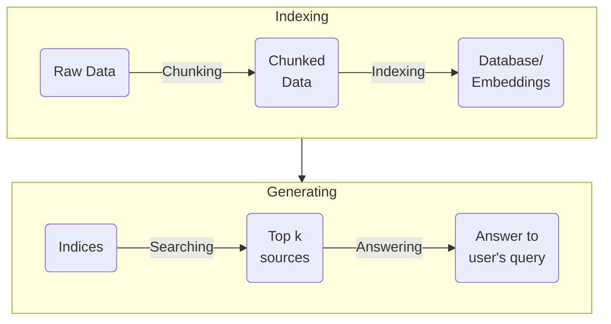

*This project has been created as part of the 42 curriculum by mpouillo.*

# RAG against the machine

[](https://github.com/mpouillo/42-rag-against-the-machine/actions/workflows/lint.yml)

- [Instructions](#instructions)
- [Description](#description)
	- [Overview](#overview)
	- [System architecture](#system-architecture)
	- [Chunking strategy](#chunking-strategy)
	- [Retrieval method and performance analysis](#retrieval-method-and-performance-analysis)
	- [Design decisions](#design-decisions)
	- [Challenges faced](#challenges-faced)
	- [Example usage](#example-usage)
- [Resources](#resources)

## Instructions

Install the project using the provided Makefile:

```shell
$> make install
# Installing uv...
# Creating virtual environment and installing dependencies...
```

Available commands:

```shell
$> uv run python3 -m src index [--max_chunk_size=<int:2000>]
# Index data from 'data/raw/' and save it to 'data/processed/'

$> uv run python3 -m src search <query> [--k=<int:10>]
# Search index and retrieve top k matching sources for provided query

$> uv run python3 -m src search_dataset <dataset_path> [--k=<int:10>] [--save_directory=<path>]
# Search index and retrieve top k matching sources for each query
# in the provided dataset, saving results to file.

$> uv run python3 -m src answer <query> [--k=<int:10>]
# Search index and retrieve top k matching sources for provided query,
# then answer them using a LLM.

$> uv run python3 -m src answer_dataset <student_search_results_path> [--save_directory=<path>]
# Answer dataset queries based on retrieved sources using a LLM,
# saving results to file.

$> uv run python3 -m src evaluate <student_answer_path> <dataset_path> <k> <max_context_length>
# Evaluate student search results based on reference dataset.
```

Enable hybrid retrieval when computing index and search results:

```shell
$> export HYBRID_RETRIEVAL=True
```

Check source code for programmatic and stylistic errors:

```shell
$> make lint
# Running flake8 and mypy...

$> make lint-strict
# Running flake8 and mypy --strict...
```

Remove any temporary files (`__pycache__` or `.mypy_cache`):

```shell
$> make clean
# Cleaning temporary files...
```

Remove virtual environment files:

```shell
$> make fclean
# Removing virtual environment files...
```

## Description

### Overview

**Retrieving Augmented Generation** (RAG) is a technique that consists of supplementing a LLM with external source of information to fill the holes in its knowledge. Combining its training data with this external data allows it to provide better and more accurate answers.

Basic RAG Pipeline:

- **Indexing**: Building an index from text corpus with an embedder for retrieval.

- **Searching**: Given a query, embed the query with the embedder, then search for related context embeddings from the index.

- **Answering**: The retrieved contexts are concatenated with the query to feed into the LLM to generate the answer.

<div style="text-align:center">
	
	<p>source: <a href="https://docs.nvidia.com/nemo-framework/user-guide/24.07/rag/ragoverview.html">NVIDIA NeMo Framework User Guide</a></p>
</div>

### System architecture



- Chunking:
	- Data is parsed into small chunks of different size (all below `max_chunk_size`).

- Indexing:
	- Chunks are passed to BM25 and a Vector indexer to be indexed.
	- Index data is saved to file.

- Search:
	- Index data is loaded.
	- User query is rewritten using spaCy.
	- BM25 index is queried to retrived top matching sources.
	- if `HYBRID_RETRIEVAL` env variable is set to `True`, Vector index is also queried and sources are fused together using Reciprocal Rank Fusion (RRF).
	- The top k * 2 sources are then passed through a FlashRank reranker model.
	- Reranked sources are then deduplicated (removing chunks encompassed by bigger chunks)
	- To satisfy the k criteria, sources are padded if needed by duplicating the last source.

- Answer:
	- Only the top 3 sources are passed to the LLM.
	- Text data is retrieved for each source and joined into a larger context.
	- Using ollama, a LLM generated an answer for each user question.
	- Multithreading is used to speed up generation.

### Chunking strategy

- Ingestion: Files are retrieved using `path.rglob()` then converted into `langchain_text_splitters.Document` objects.

- Chunking: Retrieved documents are then split using  `langchain_text_splitters.RecursiveCharacterTextSplitter()`, with language set depending on the file extension. This allows clean and efficient chunking depending on the type of file (python or markdown).

- Conversion: Split documents are then converted into `MinimalSource` objects to be processed and indexed.

### Retrieval method and performance analysis

- Indexing:
	- BM25:
		- A ranking algorithm which measures term frequency and document relevance, accounting for document length normalization.
		- It is very fast but can give inaccurate results depending on the structure of the text as it is not optimized to detect rare keywords in a large text, which is often the case with code for example.
	- Vector indexing:
		- Conversion of text into vectors (lists of numbers) using an llm, to convert meaning into data. This allows retrieval of relevant chunks based on mathematical probability from their semantic meaning.
		- It is a little slower than BM25, but gives more accurate results as it can analyze semantic meaning even when keywords do not match exactly the user's query.
	- Indexing only takes a few seconds, falling way below the subject's allowed 5 minutes.

- Searching:
	- Retrieving sources from indices (and fusing them together if using hybrid retrieval) is very fast as it is based on mathematical computations.
	- Rerank:
		- FlashRank is used to rerank sources retrieved using BM25 and Vector search to slightly improve recall@k score. A LLM model analyzes each text against the user's query and gives them a rank based on their relevance to the question.
		- Searching time mostly depends on the Reranker model used, as reranking search results takes the longest time for this step. A model might take a few minutes, when another one will take a few seconds.

- Answering:
	- Only the top few sources are given to the answering LLM to improve generation speed, allowing it to process 100 questions in under a minute (depending on hardware).

- Recall@k:
	- This metric is used to calculate the proportion of retrieved sources compared to a reference dataset. If any source in the top k retrieved sources overlaps with at least 5% of one from the reference dataset, the source is considered found. The final score represents the proportion of answers found over the whole dataset.
	- For recall@5, My implementation manages to reach 90% on docs and 57% on code questions.

- Caching: Since `MinimalSource` objects do not contain original text data, to prevent thousands of read for each operation requiring the original corpus of files, text data is cached whenever a class needs access to it. This reduces file IO to once per file, instead of once per chunk (there can be many chunks per file depending on the requested `max_chunk_size`).

### Design decisions

- Hybrid retrieval: By default, my RAG implementation does NOT use hybrid retrieval; it skips vector indexing and Reciprocal Rank Fusion (RRF) as it takes more time and decreases my recall@k score by a few points. However, it can be toggled with an environment variable: `export HYBRID_RETRIEVAL=True`.

- Query rewriting: I use spaCy to parse the user's query for keywords and append them at the end of the original query. This helps BM25 retrieve more relevant sources from its index.

- Reranking: I use a FlashRank model to rerank my sources after retrieving them with BM25 (and Vector search) as I found it improved my recall@k score a little.

### Challenges faced

- Packages:
	- This project allowed us to use any package we wanted, leading me to learn many different tools: fire, langchain, bm25s, ollama, FlashRank, model2vec, spaCy, tqdm... This was as challenging as it was interesting, but nothing reading a few docs can't fix!

- Recall@k:
	- This metric was VERY hard to increase as the provided reference dataset only contains a single source, set in stone. Without knowing how it was obtained, it is very difficult to tweak the RAG pipeline to obtain results that are not simply better and more relevant to the user's query, but instead closer to the reference dataset's retrieved sources.
	- The recall@5 score to aim for was 80% on docs questions and 50% on code, and I could not get any higher than 88% and 71% after a LOT of tweaking. Many of my attempts to increase recall by adding better indexing and search methods actually led to worse scores, which was very frustrating. In the end, only the simplest methods gave decent results, since this is probably how the reference dataset's sources were obtained.

### Example usage

```shell
$> uv run python3 -m src index --max_chunk_size 2000
$> Split strings: 100%|████████████████████████████| 206119/206119 [00:02<00:00, 97698.09it/s]
$> Stem Tokens: 100%|████████████████████████████| 206119/206119 [00:00<00:00, 1221314.44it/s]
$> 100%|████████████████████████████████████████████████████| 202/202 [00:03<00:00, 54.83it/s]
$> Ingestion complete! Indices saved under data/processed/

$> export HYBRID_RETRIEVAL=True
$> uv run python3 -m src search "Where can I find information about using vllm?" --k 3
$> Processing queries: 100%|████████████████████████████████████| 1/1 [00:00<00:00,  5.07it/s]
$> {
$>     "search_results": [
$>         {
$>             "question_id": "433d77b9-d964-4378-9e8b-d752c3512b29",
$>             "question": "Where can I find information about using vllm?",
$>             "retrieved_sources": [
$>                 {
$>                     "file_path": "data/raw/vllm-0.10.1/CONTRIBUTING.md",
$>                     "first_character_index": 0,
$>                     "last_character_index": 139
$>                 },
$>                 {
$>                     "file_path": "data/raw/vllm-0.10.1/docs/design/mm_processing.md",
$>                     "first_character_index": 1025,
$>                     "last_character_index": 1512
$>                 },
$>                 {
$>                     "file_path": "data/raw/vllm-0.10.1/docs/getting_started/installation/gpu/cuda.inc.md",
$>                     "first_character_index": 7120,
$>                     "last_character_index": 7493
$>                 }
$>             ]
$>         }
$>     ],
$>     "k": 3
$> }

$> uv run python3 -m src search_dataset --dataset_path data/datasets_public/public/UnansweredQuestions/dataset_docs_public.json --k 10 --save_directory data/output/search_results
$> Fetching 10 files: 100%|███████████████████████████████| 10/10 [00:00<00:00, 272357.40it/s]
$> Download complete: : 0.00B [00:00, ?B/s]                            | 0/10 [00:00<?, ?it/s]
$> Processing queries: 100%|████████████████████████████████| 100/100 [01:35<00:00,  1.05it/s]
$> Saved dataset_docs_public to data/output/search_results/dataset_docs_public.json

$> uv run python3 -m src answer "Where can I find information about using vllm?" --k 3
$> Fetching 10 files: 100%|███████████████████████████████| 10/10 [00:00<00:00, 257319.26it/s]
$> Download complete: : 0.00B [00:00, ?B/s]                            | 0/10 [00:00<?, ?it/s]
$> Processing queries: 100%|████████████████████████████████████| 1/1 [00:00<00:00,  4.32it/s]
$> Answering queries: 100%|█████████████████████████████████████| 1/1 [00:01<00:00,  1.39s/it]
$> {
$>     "search_results": [
$>         {
$>             "question_id": "9d0d863a-dd2b-473f-8860-52ec449ee664",
$>             "question": "Where can I find information about using vllm?",
$>             "retrieved_sources": [
$>                 {
$>                     "file_path": "data/raw/vllm-0.10.1/CONTRIBUTING.md",
$>                     "first_character_index": 0,
$>                     "last_character_index": 139
$>                 },
$>                 {
$>                     "file_path": "data/raw/vllm-0.10.1/docs/getting_started/installation/gpu/cuda.inc.md",
$>                     "first_character_index": 7389,
$>                     "last_character_index": 7493
$>                 },
$>                 {
$>                     "file_path": "data/raw/vllm-0.10.1/docs/design/mm_processing.md",
$>                     "first_character_index": 1025,
$>                     "last_character_index": 1512
$>                 }
$>             ],
$>             "answer": "To find information about using vLLM, visit [docs.vllm.ai](https://docs.vllm.ai/en/latest/contributing/)."
$>         }
$>     ],
$>     "k": 3
$> }

$> uv run python3 -m src answer_dataset --student_search_results_path data/output/search_results/dataset_docs_public.json --save_directory data/output/search_results_and_answer
$> Loaded 100 questions from data/output/search_results/dataset_docs_public.json
$> Answering queries: 100%|█████████████████████████████████| 100/100 [00:35<00:00,  2.82it/s]
$> Processed 100 of 100 questions
$> Saved student_search_results_and_answer to data/output/search_results_and_answer/dataset_docs_public.json

$> uv run python3 -m src evaluate --student_answer_path data/output/search_results/dataset_docs_public.json --dataset_path data/datasets_public/public/AnsweredQuestions/dataset_docs_public.json --k 10 --max_context_length 2000
$> Student data is valid: True
$> Total number of questions: 100
$> Total number of questions with sources: 100
$> Total number of questions with student sources: 100
$>
$> Evaluation Results
$> ========================================
$> Questions evaluated: 100
$> Recall@1:  0.570
$> Recall@3:  0.840
$> Recall@5:  0.860
$> Recall@10: 0.870
```

## Resources

- [What is RAG? (Google Cloud)](https://cloud.google.com/use-cases/retrieval-augmented-generation)
- [LangChain Reference Docs](https://reference.langchain.com/)
- [Python Fire Guide](https://google.github.io/python-fire/guide/)
- [Using Ollama with Python: A Simple Guide](https://medium.com/@jonigl/using-ollama-with-python-a-simple-guide-0752369e1e55)
- [Ollama Python GitHub repository](https://github.com/ollama/ollama-python)
- [bm25s Github repository](https://github.com/xhluca/bm25s)
- [spaCy Docs](https://spacy.io/usage)
- [model2vec Github repository](https://github.com/MinishLab/model2vec)
- [Reciprocal Rank Fusion (RRF) explained in 4 mins — How to score results from multiple retrieval methods in RAG](https://medium.com/@devalshah1619/mathematical-intuition-behind-reciprocal-rank-fusion-rrf-explained-in-2-mins-002df0cc5e2a)
- [Understanding Vector Indexing: A Comprehensive Guide](https://medium.com/@myscale/understanding-vector-indexing-a-comprehensive-guide-d1abe36ccd3c)
- AI was used to learn programming concepts and help with debugging.


---
<p align="right"><a href="#rag-against-the-machine">Back to top</a></p>
